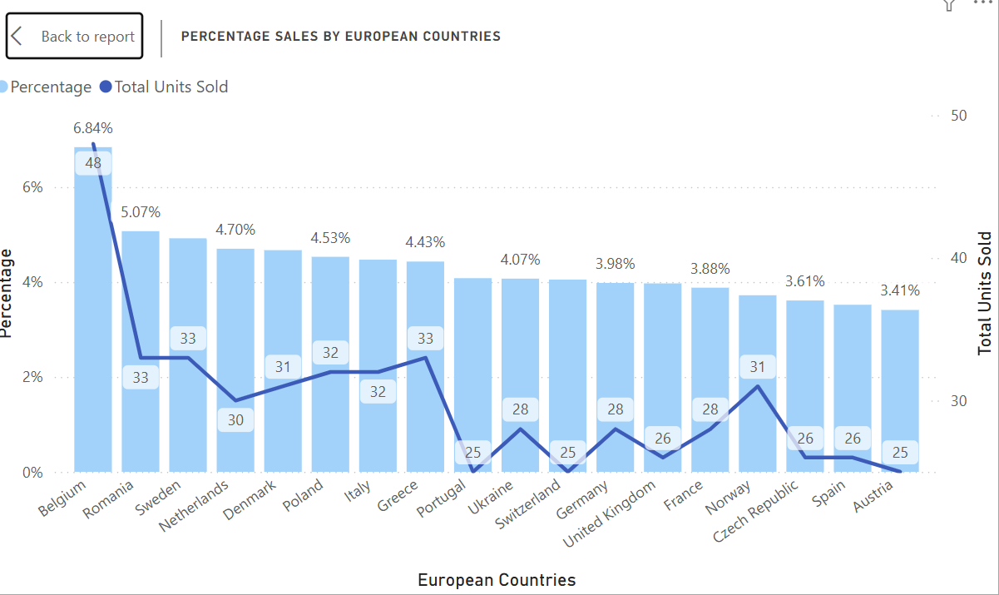
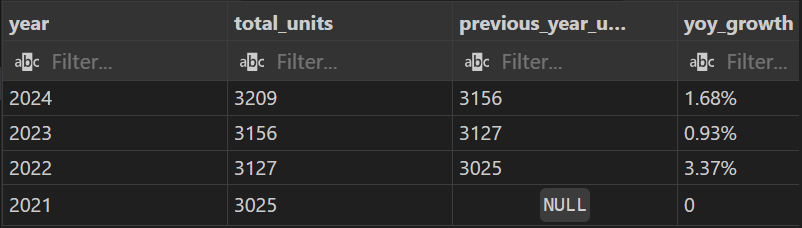
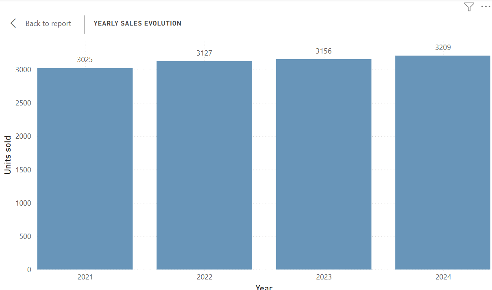
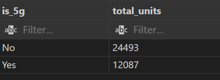
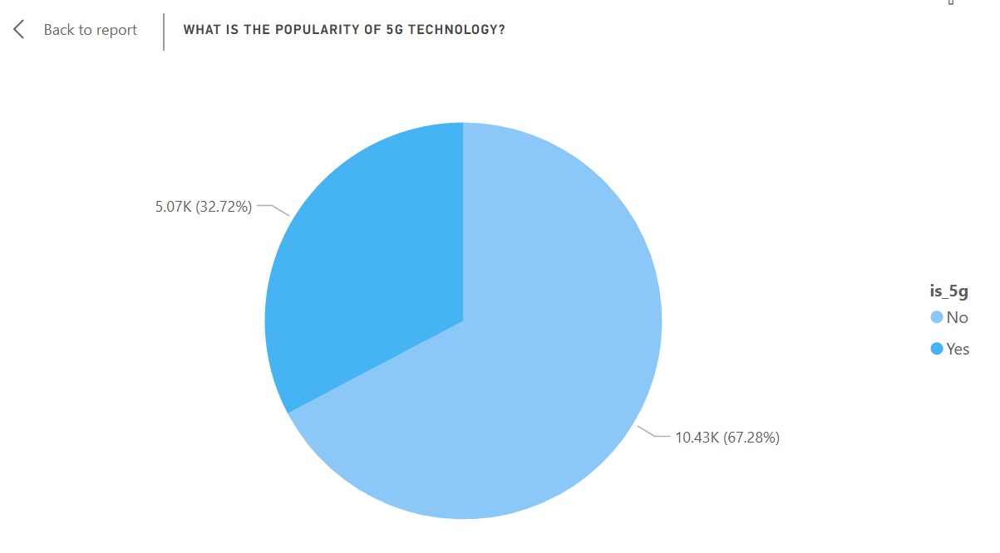
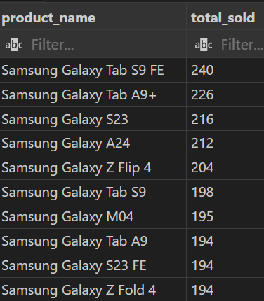
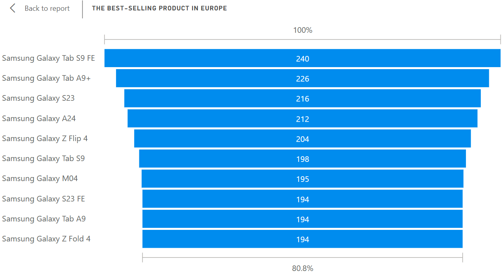
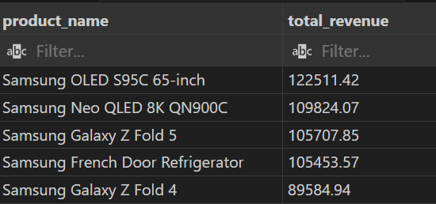

# Introduction
This sale analysis explores the financial perfomance of Samsung Electronics products from 2021 until 2024.
The project uses practice data from Kaggle, annual reports to identify consumer trends, percentage sales, best-selling poducts in Europe and popularity of 5G technology.
For the sql queries I used check here : [Samsung sales performance analysis](sql_load_samsung).
# Background
The database used for this project can be accesed here [Practice database](samsung_global_sales_dataset.csv).

### The questions I wanted to answer trough my SQL queries were:
1. What is the percentage sales by country?
2. What is the Annual report yoy growth?
3. What is the popularity of 5G technology?
4. What are the best-selling product in Europe?
5. What are the top 5 products by revenue in 2024?

# Tools I used
For my dive into the sales data, I harnessed the power of several tools:
- **SQL:** The backbone of my analysis, allowing me to query the database and uncover essential information.
- **PostgreSQL:** The ideal database management system to manage sales data.
- **Visual Studio Code:** My go-to for database management and executing SQL queries.
- **Power BI:** For create displayed visualizations and make it easier to read the selected data.
- **Git and GitHub:** Essential for version control and sharing my SQL scripts and analysis, ensuring collaboration and project tracking.
# The Analysis
Each question in this project aimed to investigate specific aspects of product sales. Below I show you how I approached each question:
## 1. Percentage sales by country
To identify this percentage, I used a Common Table Expression (CTE) to build a temporary result set that performs three main tasks: *Aggregate* to sum the units sold for each unique combination of country and product name in the European region, *Country Totals* to calculate the grand total of all units sold in each country, and *Ranking* to assign a rank to the products in each country. The final selection consists of filtering by leaders to display the best-selling product for each country, then calculating the percentage and formatting the result.
``` sql
--What is the share of each product in total sales in the country (percentage)
WITH ProductSales AS (
    SELECT
    country,
    product_name,
    SUM(units_sold) AS total_sold,
    SUM(SUM(units_sold)) OVER (PARTITION BY country) AS country_total,
    RANK () OVER(
        PARTITION BY country 
        ORDER BY SUM(units_sold)DESC
    ) AS sales_rank
    FROM global_sales
    WHERE region = 'Europe'
    GROUP BY country,
     product_name
    )
SELECT
    country,
    product_name,
    total_sold,
    ROUND ((Total_sold * 100.0) / country_total, 2) ::TEXT || '%' AS percentage
FROM ProductSales; 
```
- The result shows that the **highest percentage** in Belgium is for the Samsung Galaxy Tab A9+, with 48 units sold, and a percentage of **6.84%** of total sales in Europe.




*Graphical representation in PowerBI of the percentage of sales by country in Europe*

## 2. Annual report YOY growth
This SQL query performs a Year-over-Year (YoY) comparative analysis of sales volume for the European region. The LAG  function used at this part is the standard function for this type of analysis and here it calculate the percentage change between years.
``` sql
--Annual report: extracting the year, calculating the total units sold, and using a function (LAG) to compare the results with the previous year.
--Analyze increase and decrease.
WITH YearlySale AS (
    SELECT 
        EXTRACT (YEAR FROM sale_date) AS year,
        SUM(units_sold) AS Total_units
        FROM global_sales
        WHERE region = 'Europe'
        GROUP BY EXTRACT (YEAR FROM sale_date)
)
SELECT 
    year,
    Total_units,
    LAG (Total_units) OVER (ORDER BY year) AS previous_year_units,
    CASE 
        WHEN LAG (Total_units) OVER (ORDER BY year) IS NULL THEN '0'
        ELSE 
            ROUND (
            ((Total_units - LAG (Total_units)OVER (ORDER BY year)) * 100.0 ) 
            / LAG (Total_units) OVER (ORDER BY year),
             2
        )   ::TEXT ||'%'
    END AS yoy_growth,
    CASE 
        WHEN Total_units > LAG (Total_units)OVER (ORDER BY year) THEN 'Increase'
        WHEN Total_units < LAG (Total_units)OVER (ORDER BY year) THEN 'Decrease'
        WHEN Total_units = LAG (Total_units)OVER (ORDER BY year) THEN 'Constant'
        ELSE 'N/A'
    END AS trend_status
    FROM YearlySale
    ORDER BY year DESC;
```
The results show the percentage increase for each year compared to the previous year.


 
 *The table resulting from the query*



*PowerBI yoy evolution*

## 3. Popularity of 5G technology

The goal here is to determine the market share of 5G technology. 
This query is straightforward aggregartion designed to compare the sales perfomance of 5G_enabled products against non-5G products, applied to the global sales.

``` sql
--Product segmentation and specifications
SELECT 
is_5g,
SUM(units_sold) AS total_units
FROM global_sales
GROUP BY is_5g;
```




*This is the result of my query as a table*



*PowerBi visualization for 5g vs. non-5g*

 After this analysis, I would say that 5G products are still a niche segment compared to older technologies.

## 4. The best-selling product in Europe

Now I want to find out which product is the most sought after in Europe. Using the query below, where I have filtered the European region from all products sold and placed them in descending order, it seems that the highest sales are for the Samsung Galaxy Tab S9 FE, with a total of 240 units sold during the analyzed period.

```sql
--The best-selling product in Europe
SELECT
    product_name,
    SUM(units_sold) AS Total_sold
    FROM global_sales
    WHERE region = 'Europe'
    GROUP BY product_name
    ORDER BY Total_sold DESC
    LIMIT 10;
```


*Top 10 best-selling products in Europe.*



*PowerBI visual for top 10 best-selling products in Europe*


## 5. Top 5 products by revenue in 2024

To identify the totp 5 products by revenue sold globally in 2024 i used the query below.
It takes the product names and calculates the revenue by multiplying the number of units sold by their price, filtering by the year, grouping by product name and ordering desc by total revenue so that the products with the highest revenue appears on the top.


``` sql
--Top 5 products by revenue in 2024
 SELECT
     product_name,
     SUM(units_sold * unit_price_usd) AS total_revenue
FROM global_sales
WHERE sale_date >= '2024-01-01'
GROUP BY product_name
ORDER BY total_revenue DESC
LIMIT 5;
```



*The top 5 products by revenue, out of all units sold globally.*

These 5 products analyzed recorded revenues between $89584.94 and $122511.42. 


# What I Learned

1. **Complex SQL skills** - Using SQL, I learned and applied from the simplest queries to advanced ones such as CTE, JOIN, operations, aggregations, GROUP BY, ORDER BY, LAG, RANK, strengthening my knowledge of manipulating data tables.
2. **PowerBI skills** - Using PowerBI I learned how to do visual analysis of certain data sets by applying the .csv result of my SQL queries.
3. **Analytical vision** -  I improved my real-world puzzle solving skills by turning questions into useful SQL queries and adding visual analysis to the result. Using these two powerful tools together, I was able to render the analysis results in two easy-to-read and analyze ways.

## Insights 

- **Percentage sales by country** : Analyzing the percentage of sales by country in Europe, it seems that Belgium sold the most products, with a percentage of 6.84% and the lowest was in Austria with a percentage of 3.41%.
- **Annual report YoY (year-over-year) growth**: Analyzing the YoY increases of global sales percentage, starting with 2021 and up to 2024 inclusive, it appears that in 2022 the growth is 3.37%, a slow one in 2023 of only 0.93%, and in 2024 the percentage increases to 1.68%. 
- **Popularity of 5G technology**: 
Of all products sold globally, only 32.72% are 5G, and the remaining 67.28% shows that buyers were more attracted to products that did not include this technology.
- **The best-selling product in Europe**: 
Samsung Galaxy Tab S9 FE is the most wanted product in Europe with a total of 240 units sold during the years analyzed.
- **Top 5 products by revenue in 2024**:
Samsung's 65-inch OLED S95C is the product that generated the most revenue in 2024, reaching a total of $122,511.42. Followed by the Samsung Neo QLED 8K QN900C, which generated $109,824.07, then Samsung Galaxy Z Fold 5, which brought in $105,707.85, and very closely by the Samsung French Door refrigerator with $105,453.57. In 5th place was the Samsung Galaxy Z Fold 4, with $89,584.94.
### Closing Thoughts
Working on this project I learned a lot of skills for both SQL and PowerBI. I understood how to put my interogations in queries to can find answers regarding data analysis. During this project I improved my knowledge of what a database really is and how data structures work. This project not only improved my skills, but also made me have an analytical mindset, a better structured overview and move from learning concepts to applying them in real analyses.